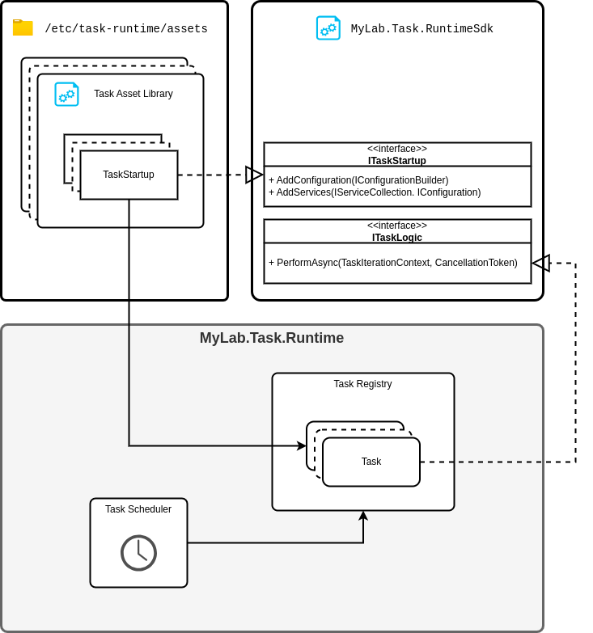

# MyLab.Task.Runtime

`MyLab.Task.Runtime` - среда размещения и запуска задач.

Ознакомьтесь с последними изменениями в [журнале изменений](/CHANGELOG.md).

SDK NuGet: [](https://www.nuget.org/packages/MyLab.Task.RuntimeSdk)

## Обзор

`MyLab.Task.Runtime` (далее "`Runtime`") - сервис, обеспечивающий периодическое выполнение задач, реализованных в соответствии с `MyLab.TaskRuntimeSdk` (далее "`SDK`") на платформе `.NET 5.0+`. 

При старте, `Runtime` загружает библиотеки с задачами (далее "ассеты") из директории ассетов. В этих ассетах находятся классы, реализующие интерфейс `ITaskStartup`(из `SDK`). В одном ассете можеет быть несколько таких классов. C помощью объектов этих классов создаются объекты, реализующие интерфейс `ITaskLogic` (из `SDK`), которые должны содержать логику конкретной задачи. При создании объекта задачи применяется персональная конфигурация для каждой задачи.

Созданные объекты логики задач сопоставляются с соответствующей конфигурацией и регистрируются в планировщике с указанным в конфигурации периодом запуска.



## Ассет

### Что такое Ассет?

`Ассет` - библиотека с зависимостями, содержащая набор классов, реализующих соответствующие интерфейсы из `SDK` для реализации логики выполнения задач. Другими словами, с точки зрения разработчика задачи - это собранный проект, в котором реализованы классы логики задач и классы инициализации этих объектов логики. 

### ITaskStartup

#### Об интерфейсе ITaskStartup 

Задача в ассете определяется классами, реализующими интерфейс `ITaskStartup`, далее "стартап". Требование к классам:

* реализует интерфейс `ITaskStartup`;
* публичный;
* не абстрактный;
* имеет конструктор по умолчанию.

#### О реализации ITaskStartup

Стартап должен реализовать такой же функционал, как класс `Startup` в веб-приложении - инициализацию приложения. Только в данном случае масштаб приложения сужается до задачи. 

Ниже приведено объявление интерфейса стартапа.

```c#
/// <summary>
/// Initializes a task application
/// </summary>
public interface ITaskStartup
{
    /// <summary>
    /// Add custom configuration here
    /// </summary>
    void AddConfiguration(IConfigurationBuilder configBuilder);

    /// <summary>
    /// Add task logic and references here
    /// </summary>
    void AddServices(IServiceCollection services, IConfiguration configuration);
}
```

здесь:

* `AddConfiguration` - в этом методе, при необходимости, следует указать дополнительные источники конфигурации;
* `AddServices` - в этом методе следует добавить класс логики задачи, реализующей `ITaskLogic`, и его зависимости.

Логика задачи может быть зарегистрирована как с временем жизни `Singletone`, так и `Scoped`. `Scoped` - новый экземпляр на каждую итерацию.

**Важно заметить**, что добавление стартапом провайдеров логирования игнорируется. Используются настройки приложения.

### ITaskLogic

#### Об интерфейсе ITaskLogic

Стартап должен добавлять в коллекцию сервисов логику задачи. Класс логики задачи должен реализовывать интерфейс `ITaskLogic`. Требования к классу логики:

* реализует интерфейс `ITaskLogic`;
* не абстрактный.

Ниже приведено объявление интерфейса логики задачи:

```c#
/// <summary>
/// Provides task logic
/// </summary>
public interface ITaskLogic
{
    /// <summary>
    /// Performs a logic
    /// </summary>
    ValueTask PerformAsync(TaskIterationContext iterationContext, CancellationToken cancellationToken);
}
```

#### Метод PerformAsync

Метод `PerformAsync` вызывается планировщиком в момент, когда пришло время выполнить задачу. **Важно заметить**, что если в этот момент предыдущая итерация задачи всё ещё выполняется, то метод вызван не будет.

##### Параметр `iterationContext`

Данный параметр содержит параметры контекста и позволяет сохранить данные для отчёта выполнения задача.

Ниже приведено описание класса контекста:

```c#
/// <summary>
/// Provides access to task logic iteration context  
/// </summary>
public class TaskIterationContext
{
    /// <summary>
    /// Trace identifier
    /// </summary>
    public string? TraceId { get; }
     /// <summary>
    /// Date and time of iteration start
    /// </summary>
    public DateTime StartAt { get; }
     /// <summary>
    /// Iteration report. 'null' by default.
    /// </summary>
    public IterationReport? Report { get; set; } = null;
}
```

Поля контекста:

* `TraceId` - идентификатор трассировки, назначается уникальный для каждой итерации;

* `StartAt` - содержит дату и время запуска текущей итерации;

* `Report` - устанавливает отчёт о выполнении итерации задачи, который будет отправлен в [протокол](#Протокол).

##### Параметр `cancellationToken`

Передаёт токен отмены для прерывания выполнения задачи. Следует ориентироваться на этот токен при выполнении циклов и  между этапами длительной работы. 

### Имя задачи

Имя задачи - уникальное строковое значение, идентифицирующее задачу. Образуется из имени ассета и имени задачи (при наличии), назначенного разработчиком.

Имя задачи используется:

* в логах - автоматически добавляется в события, связанные с какой-либо задачей в метке `task`;
* в протоколе - указывается в записях протокола об итерациях в поле `type`;
* в конфигурации - чтобы указать персональную конфигурацию для задачи.

Имя задачи, указанное разработчиком называется локальным. Потому что локальное в пределах ассета. Оно должно быть уникальным в пределах ассета. 

Локальное имя можно установить, с помощью атрибута `TaskNameAttribute` на классе стартапа:

``` c#
[TaskName("foo")]
public class MyTaskStartup : ITaskStartup
{
    //...
}
```

Имя задачи, содержащее имя ассета и локальное имя называется квалифицированным и является уникальным для всех задач всех ассетов в одном `Runtime` экземпляре.

Квалифицированное имя задачи формируется по следующему шаблону:

```
{asset}:{local}
```

или при отсутствии локального имени задачи:

```
{asset}
```

Например, если ассет называется `kolot-drova`, и в нём есть единственная безымянная задача, то квалифицированное имя этой задачи будет `kolot-drova`. 

Если такой ассет содержит именованные задачи, то их имена будут, например, такие:

```
drova:kolot
drova:zshech
drova:rostit
```

Рекомендуется использовать в качестве имён глаголы в нижнем регистре с дефисом-разделителем. Например: 

* `send-requests`
* `receive-responses`
* `remove-old-files`

## Загрузка ассетов

`Runtime` при запуске загружает ассеты  из директории ассетов. В этой директории должны располагаться поддиректории, содержащие библиотеки ассетов и их зависимости. Имена этих поддиректорий принимается за имя ассета. Библиотека ассета должна иметь такое же имя, как и директория.

Пример c ассетом `drova`:

```sh
> ls -1 /etc/task-runtime/assets
> drova

> ls -1 /etc/task-runtime/assets/drova
> drova.dll
> Reference1.dll
> Reference2.dll
```

## Конфигурация

### Состав конфигурации

Конфигурация приложения осуществляется [стандартными средствами .NET](https://learn.microsoft.com/en-us/dotnet/core/extensions/configuration) и может быть установлена через файлы или переменные окружения.

Имя узла конфигурации приложения - `Runtime`. 

Поля конфигурации:

* `AssetPath` - путь к директории с ассетами. По умолчанию - `/etc/task-runtime/assets`;
* `ProtocolId` - идентификатор [протокола](#протокол). `tasks` - по умолчанию;
* `BaseTaskConfig` - общая часть конфигурации для всех задач. Опциональный параметр;
* `Tasks` - персональные конфигурации задач.  Опциональный параметр. Словарь, где ключ - [квалифицированное имя задачи](#Имя-задачи), а значение - объект конфигурации задачи, который содержит следующие поля:
  * `Period` - период выполнения задачи в формате, поддерживаемом [парсингом класса TimeSpan](https://learn.microsoft.com/ru-ru/dotnet/api/system.timespan.parse?view=net-5.0);
  * `Config` - корень конфигурации задачи. Опциональный параметр. 

Пример конфигурации с ассетом и задачей по умолчанию:

```json
{
  "Runtime": {
    "Tasks": {
      "kolot-drova": {
        "Period": "00:01:00",
        "Config": {
          "Param1": "val1",
          "Param2": "val2"
        }
      }
    }
  }
}
```

Из-за формата квалифицированного имени, конфигурации задач одного ассета группируются. Например:

``` json
{
  "Runtime": {
    "Tasks": {
      "drova": {
        "kolot": {
          "Period": "00:01:00",
          "Config": {
            "Param1": "val1",
            "Param2": "val2"
          },
          "zshech": {
            "Period": "00:01:00",
            "Config": {
              "Param1": "val1",
              "Param2": "val2"
            }
          },
          "rostit": {
            "Period": "00:01:00",
            "Config": {
              "Param1": "val1",
              "Param2": "val2"
            }
          }
        }
      }
    }
  }
}
```


### Конфиг задачи

При создании задачи используется сборная конфигурация, которая собирается следующими слоями, каждый следующий из которых может переопределять предыдущие:

* узел `Logging` конфигурации приложения `Runtime`;
* узел `Runtime:BaseTaskConfig` - общая часть конфигурации для всех задач;
* узел `Runtime:Tasks:[task-name]:Config`;
* добавление специфической конфигурации стартапа `startup.AddConfiguration(...)`.

## Запуск задач

### Конкуренция

`Runtime` загружает и регистрирует для каждую задачу для одиночного запуска по расписанию. Это значит, что в одно и тоже время может выполняться только одна итерация задачи. Ограничений между задачами нет. Т.е. если планировщик задачи собрался выполнить задачу из-за того, что очередной период подошёл к концу, а в это время предыдущая итерация задачи ещё не закончена, то выполнение очередной итерации будет пропущено и перенесено на следующий период.

Задачи выполняются параллельно в пуле потоков. Выполнение задач асинхронное. 

### Трассировка

В приложении `Runtime` используются инструменты трассировки из [OpenTelementry](https://github.com/open-telemetry/opentelemetry-dotnet).  

Для каждой итерации задачи устанавливается активность трассировки. В пределах выполнения задачи доступен текущий идентификатор трассировки как через [контекст](#Параметр-iterationContext), так и через `Activity.Current.TraceId`. 

**Важно заметить**, что идентификатор трассировки автоматически добавляется во все логи, написанные в пределах выполнения задачи. Также идентификатор трассировки автоматически добавляется во все исходящие HTTP запросы при условии использования [IHttpClientFactory](https://learn.microsoft.com/en-us/dotnet/core/extensions/httpclient-factory). 

## Протокол

## Развёртывание


 
